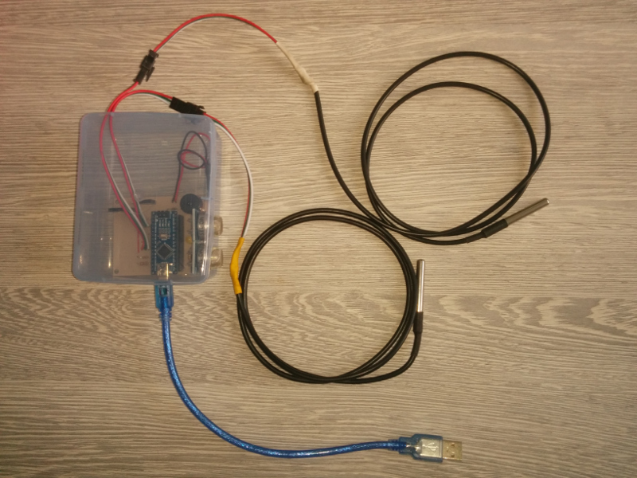

# BlueSensor
Arduino based device for temperature, air humidity and gas concentration measurment .

## Hardware
PCB dimension is 70mm x 55mm. Schematics is available in two PDF files (BlueSensor_v1.1_PCB_top.pdf and BlueSensor_v1.1_PCB_top_miror.pdf). PCB can be manufactured with chemo transfer method; in that case mirror image should be used.

Needed materials:
- 1x Arduino Nano
- 2 x MQ2-x gas sensors*
- 1 x DHT-22 (AM2302) humidity and temperature sensor
- 2 x (max 4 x) DS12B20 temperature sensor (on a cable)
- 1 x buzzer
- 1 x LED diode
- 1 x 4.7k Ohm resistor
- 1 x 270 Ohm resistor
- 1 x 100 Ohm resistor
- 1 x battery case (for 4 x AAA batteries)

PCB is designed to additionally connect:
- 1 x HC-05 Bluetooth module
- 1 x 2k Ohm resistor
- 1 x 4.6k Ohm resistor

However this hardware is not supported in a current code yet.

MQ-x gas sensor are cheap sensors for detecting leakage of various gases: 
- MQ-2: combustible gases
- MQ-3: alcohol
- MQ-4: CH4，natural gas
- MQ-5: LPG, natural gas, coal gas
- MQ-6: LPG
- MQ-7: carbon monoxide
- MQ-8: hydrogen
- MQ-9: carbon monoxide and combustible gases
- MQ-135: air quality sensor

They have analog output and are not calibrated.



## Software
Python *application bluesensor-server.py* is used for displaying data from BlueSensor or SDS dust sensor in a web application. Appication runs web server on a localhost and calls data reader.

Currently there are two data readers available:
- **read-raw-serial** (in *read-raw-serial.py*), which reads raw (tab-delimited) data from BlueSensor connected to USB port;
- **read-dust** (in *read-dust.py*), which reads JSON formatted data from SDS011, SDS018 or SDS021 dust sensor.

First you need to install Tornado Python web server. Od Ubuntu/Debian based systems you can do it with:
```sudo pip install tornado```

Then you connect BlueSensor or SDS dust reader to USB port and run:
- for reading data from BlueSensor connected to ttyUSB0:
```python bluesensor-server.py read-raw-serial 0```
- for reading data from SDS dust reader (dust reader should always be connected to ttyUSB0):
```python bluesensor-server.py read-dust```


When application is started, you can open URL which is printed in console:
- for BlueSensor data from ttyUSB0: http://localhost:8080/
- for BlueSensor data from ttyUSB1: http://localhost:8081/, etc...
- for SDS dust sensor data: http://localhost:8089/

Arduino firmware for BlueSensor is available in a file *BlueSensor_plain_codeweek.ino*. Currently data from BlueSensor are printed in CSV form. Future version will use JSON formatting. Dust reader already uses JSON formatting.
